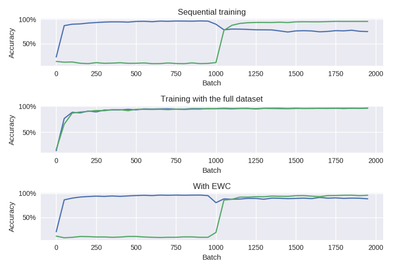

# Less Forgetful Neural Networks Using Elastic Weight Consolidation

## Problem

When training a neural network sequentially on two or more tasks, the weights learned for the first tasks will get overwritten as weights are learned for the latter tasks.
This is referred to as **catastrophic forgetting**.
The top graph shows how the accuracy goes down on the first dataset as we begin training with a second dataset.

One way to avoid catastrophic forgetting is to ensure that all training data is available during the initial training.
The second graph from the top shows how we can get good performance on both datasets if we use both of them when training the network from the start.

Alternatively, we could be storing (some) data from previous training sessions to be replayed to the network as it learns new tasks to prevent it from forgetting previously learned ones.
None of these solutions are fully satisfactory; all training data might not be available at the start, or there might be very large amounts of training data and it would be impractical to store it or to replay it to the network later. 

## Solution

The solution is inspired by an observation about mammalian brains.
As animals learn new tasks, the related synapses in the brain are strengthened, making them less plastic and thus less likely to be overwritten.

The idea translates to artificial neural networks as follows:
we slow down reassignment in weights that have been identified to be important for previous tasks.
This is something of a Bayesian approach: we have prior information about the values of the weights and how certain we are about those values.

In practice, there is a quadratic penalty added to the cost function for moving the weights from their original positions.
The importance is represented by the diagonal of the Fisher information matrix.
The algorithm is called **Elastic Weight Consolidation**.
(See [Kirkpatrick et al., 2016](https://arxiv.org/pdf/1612.00796.pdf)). 

The bottom graph shows how we can use EWC to maintain relatively good performance on the first dataset even when the dataset is no longer used for training.
Other things that affect performance is the importance we place on the old values, and the capabilities of the network to learn many tasks (= the number of nodes and layers).

## Setup

### Data

One of the experiments in the paper uses data from the MNIST dataset (handwritten digit classification).

To generate additional datasets, fixed permutations are applied to the data.

#### Example

A figure seven(?) from the original MNIST dataset.

The same figure permuted randomly to create a new dataset of equal complexity.

### Neural network

Partially following the setup in the paper, our network is a fully connected "traditional" MLP with ReLU activation functions.
The network has two hidden layers with weight and bias nodes.
We use stochastic gradient descent for the weight optimization.
(For further details, probably best to look at the code as I might have shuffled some things around.)

## Reproducing the "catastrophic forgetting" effect

The first part is easy:
we define the network architecture and train it normally with the original dataset.
After that, we start training it on the second dataset (as if we were starting from scratch with random weights).

After every SGD minibatch we evaluate the performance on both the first dataset and the second one.
Initially, the performance on the second dataset is basically as good as guessing, as the datasets don't resemble each other at all.
As we start training on the second dataset, the network forgets some of what it had learned about the original one, and the accuracy becomes worse.

## Learn both tasks together

This one's partly just sanity-checking:
we expect that the network will be able to learn good weights for both tasks at the same time.
The graph shows that we reach similar levels of accuracy here as we did for each dataset individually in the first experiment.

(The accuracy is nowhere near state-of-the-art, but good enough to demonstrate the effects.)

## Adding in Elastic Weight Consolidation

We first train the network normally (using the same cross-entropy cross function as we used for both setups above).

Then, we save the optimal weight values for the first task (the squared penalty will be relative to these), and also compute the Fisher diagonal from the first dataset.
During the second training round, we are using an augmented cost function with an additional penalty term defined as in the paper.

## Future work

- Parallelize computation of the Fisher diagonal for speed. See *stokesj*'s implementation for reference.
- Test overlap of Fisher information, like in the paper.
- Teach the network contradictory datasets and see how that affects performance (e.g. instead of permutations of the MNIST dataset, take "inverted" images).
- Define a way to train beyond the second dataset.

## Links

- [TensorFlow and Deep Learning, Without a PhD](https://codelabs.developers.google.com/codelabs/cloud-tensorflow-mnist/#0)
- [Another TensorFlow EWC implementation on GitHub by James Stokes](https://github.com/stokesj/EWC)
- [Overcoming catastrophic forgetting in neural networks. *Kirkpatrick et al., 2016.*](https://arxiv.org/pdf/1612.00796.pdf)
