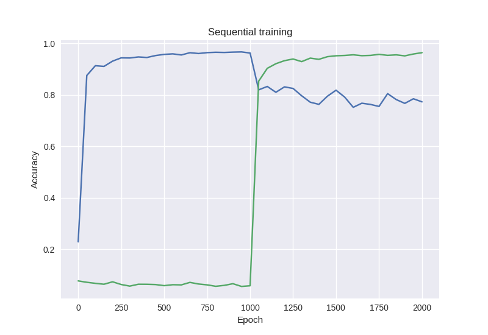

# Less Forgetful Neural Networks Using Elastic Weight Consolidation

This work is based on a DeepMind paper ([Kirkpatrick et al., 2016](https://arxiv.org/pdf/1612.00796.pdf)).

**Problem.** When training a neural network sequentially to perform multiple different tasks, the first tasks will be overwritten by the latter (in that the weights in the network are "repurposed" to better fit the latter tasks, and no longer represent what was originally learnt for the first task). This is referred to as catastrophic forgetting.

**Solution.** The solution is inspired by nature and recent research into how mammals such as ourselves are able to continuously learn different tasks without overwriting previous ones. (Now, I'm not a brain researcher...) Learning a task that uses particular synapses strengthens those synapses, making them more persistent to prevent subsequent learned tasks from "overwriting" what was saved in them. The corresponding solution in artificial neural networks, as suggested by Kirkpatrick et al., is called *elastic weight consolidation*, and it works by slowing down learning in nodes that are vital for some previously learned task.

## Data

One of the experiments detailed in the paper uses data derived from the MNIST dataset, used as input for a classification task. (The other, more interesting one uses the network to learn to play Atari games. Also see e.g. [DQN](https://deepmind.com/research/dqn/) and the [Arcade Learning Environment](https://github.com/mgbellemare/Arcade-Learning-Environment).)

This experiment uses the simpler classification data (which has a bit of a hello-world status in machine learning and classification, so the advantage is that I was already familiar with the dataset, and quite possibly most people reading this will be as well).

## Reproducing the "catastrophic forgetting" effect

The different tasks will be to classify handwritten digits in

1. their original form
2. in a "permuted" form (we specify a transformation to apply to the MNIST data).

I will first train the network to classify handwritten digits as usual, and measure its performance. 
Then I'll continue training the network on the permuted dataset, and measure its performance on both the first and the second dataset. 
The expected result is that the performance gets drastically worse on the first dataset.

## One solution: Learn both tasks together

Downsides: we have to have all the data at the start (or need to retrain the network on *all* previous data every time we want to teach it a new task.)

## Adding in Elastic Weight Consolidation

Same setup as above, but this time with the technique as described in the paper.
The expected result is that the performance on the first dataset will remain much better than without EWC.

## Links

- [TensorFlow and Deep Learning, Without a PhD](https://codelabs.developers.google.com/codelabs/cloud-tensorflow-mnist/#0)