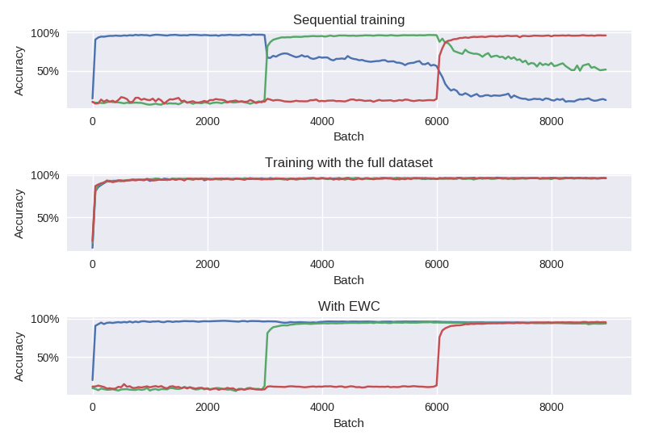
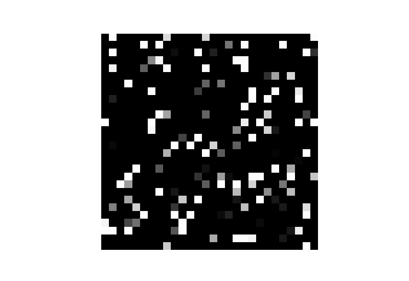

# Less Forgetful Neural Networks Using Elastic Weight Consolidation

## Problem

When training a neural network sequentially on two or more tasks, the weights learned for the first tasks will get overwritten as weights are learned for the latter tasks.

This is referred to as **catastrophic forgetting**.

The top graph shows the effect on a sequentially trained neural network.
The network first learns the first dataset and performs well on it.
It then starts to learn a different dataset and isn't exposed to the first dataset again except for evaluation.

The *accuracy* (ratio of correctly classified examples in the validation set) on the first dataset goes down as the same weights are repurposed to fit the second one.

## Solution

### Some less satisfactory approaches...

One way to avoid catastrophic forgetting is to **ensure that all training data is available at the start**.

Alternatively, we could be **storing (parts of) previously learned data so it can periodically be replayed to the network** as it learns other tasks.

The second graph from the top shows a network with the same structure as the first one, trained using the same data.
The only difference here is that the two datasets are shuffled together at the start of the training, so the network learns weights that work with both.
We can see here that the network is able to learn similar levels of high accuracy for both datasets.
 
For accuracy, this approach seems to work.
However, the major disadvantage is that the ability of the network to "summarize" a task it has already learnt is completely lost when retraining.
The amount of data could be impractically large to store.
Having to replay all previous tasks to the network for it to learn one more task could be impractically slow if the network is taught very many tasks.

### A new approach: Elastic Weight Consolidation

The solution is inspired by an observation about mammalian brains.
As animals learn new tasks, the related synapses in the brain are strengthened, making them less plastic and thus less likely to be overwritten.

The idea translates to artificial neural networks as follows:
we **slow down reassignment in weights that have been identified to be important** for previous tasks.
This is something of a Bayesian approach: we have prior information about the values of the weights and how certain we are about those values.

In practice, there is a quadratic penalty added to the cost function for moving the weights from their original positions.
The importance is represented by the diagonal of the Fisher information matrix.
The algorithm is called **Elastic Weight Consolidation**.
(See [Kirkpatrick et al., 2016](https://arxiv.org/pdf/1612.00796.pdf)). 

The bottom graph shows how we can use EWC to maintain relatively good performance on the first dataset even when the dataset is no longer used for training.
Other things that affect performance is the importance we place on the old values, and the capabilities of the network to learn many tasks (= the number of nodes and layers).

## Setup

This project loosely follows one of the setups described in the paper (same dataset, similar network for classification).

### Data

The data comes from the [MNIST dataset](http://yann.lecun.com/exdb/mnist/) for **handwritten digit classification**.
You'll probably have heard of it.

The first dataset are the MNIST digits in their original form.
Additional datasets of equal complexity are generated by applying fixed permutations to the data.
(See example.)

#### Example

A figure seven(?) from the original MNIST dataset.

The same figure permuted randomly for the second dataset.

### Neural network

The network is a fully connected "traditional MLP" with two hidden layers.

The weight optimization uses stochastic gradient descent.

The whole thing is implemented using [**TensorFlow**](https://www.tensorflow.org/).

This also happens to be my first project using TensorFlow.
I found [this tutorial](https://codelabs.developers.google.com/codelabs/cloud-tensorflow-mnist/#0) a useful resource for setting things up. :)

### How to run this project

Unfortunately, I didn't prepare a `requirements.txt`.
You will need at least TensorFlow, `numpy` and `matplotlib` installed.
The project is written for Python 3.

TensorFlow will automatically download the data if you don't have it yet, or you can point the script to the directory where the data resides if you do.

    python3 main.py --help
    
should run fast and show you the (few) available options.

The `plot*` files are separately executed to plot features of the data.
You might find it more practical to call the code from an interactive environment like Jupyter or just the Python shell in case something needs changing. :)

## Reproducing the "catastrophic forgetting" effect

    python3 main.py --mode simple
    
The first part is easy:
we define the network architecture and train the network on the original dataset as we normally would.
After that, we start training on the second dataset (as if we were starting from scratch).

The accuracy on both validation sets is evaluated after each SGD minibatch.
This feeds into the plotting script, which would produce an image similar to the one at the start of this README.

## Learn both tasks together

    python3 main.py --mode mixed

This part works for sanity-checking:
we expect that the network is, in general, able to learn good weights for both tasks at the same time.
The plotted image near the top confirms that this is the case.

(The overall accuracy is nowhere near state-of-the-art for the MNIST classification task, but is good enough to demonstrate the effects.)

## Adding in Elastic Weight Consolidation

We first train the network normally (using the same cross-entropy cross function as we used for both setups above).

Then, we save the optimal weight values for the first task (the squared penalty will be relative to these), and also compute the Fisher diagonal from the first dataset.
During the second training round, we are using an augmented cost function with an additional penalty term defined as in the paper.

## Future work

- Introduce dropoff regularization to the network (mentioned in the original paper and the TensorFlow tutorial) to hopefully improve overall performance.
- Parallelize computation of the Fisher diagonal for speed. See *stokesj*'s implementation for reference.
- Test overlap of Fisher information, like in the paper.
- Add an explicit hyperparameter tuning set to adjust the Fisher coefficient etc (for better performance.)
- Teach the network contradictory datasets and see how that affects performance (e.g. instead of permutations of the MNIST dataset, take "inverted" images).
- Define a way to train beyond the second dataset.

## Links

- [**TensorFlow and Deep Learning, Without a PhD.**](https://codelabs.developers.google.com/codelabs/cloud-tensorflow-mnist/#0) A good tutorial for those just starting out with TensorFlow, in my opinion. Shows how to set up a network (very similar to the one used in the original experiments for the paper) for the task, and how to improve its performance.
- [**Another TensorFlow EWC implementation on GitHub by *James Stokes*.**](https://github.com/stokesj/EWC)
- [**Comment on *Overcoming catastrophic forgetting in neural networks*. Are multiple penalties needed? by *Ferenc Huszár***](http://www.inference.vc/comment-on-overcoming-catastrophic-forgetting-in-nns-are-multiple-penalties-needed-2/)
- [**Explanation of *Overcoming catastrophic forgetting in neural networks* by *Rylan Schaeffer***](https://rylanschaeffer.github.io/content/research/overcoming_catastrophic_forgetting/main.html)

## References

- [**MNIST handwritten digit database.**](http://yann.lecun.com/exdb/mnist/) Note that TensorFlow has convenience functions to download and import this data automatically.
- [**Overcoming catastrophic forgetting in neural networks. *Kirkpatrick et al., 2016.***](https://arxiv.org/pdf/1612.00796.pdf) The original paper describing the Elastic Weight Consolidation algorithm.
